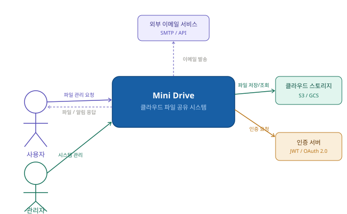
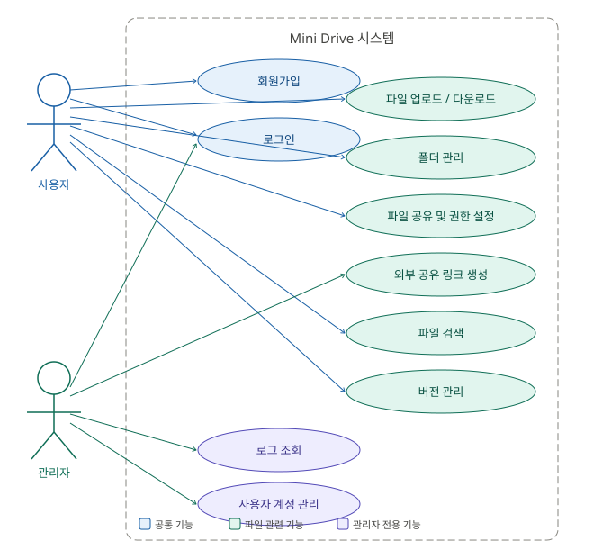
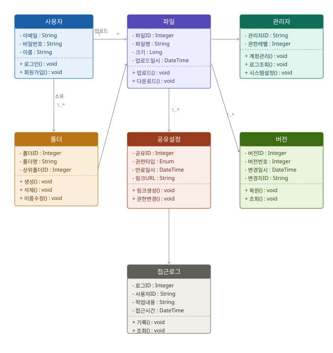
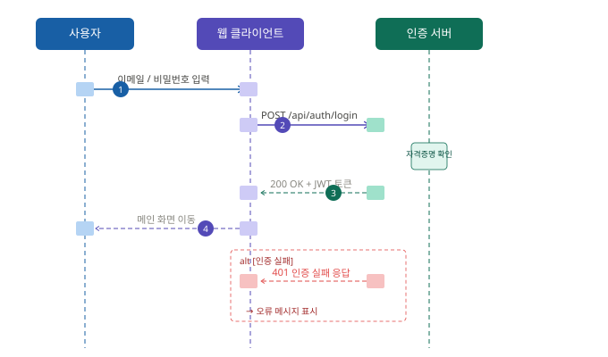
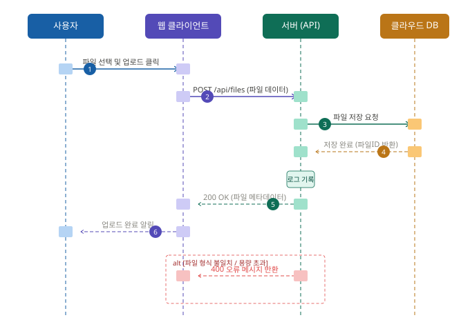
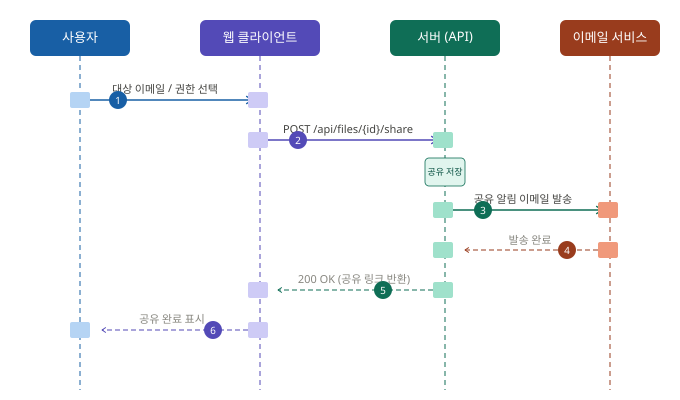

# Mini Drive (클라우드 파일 공유 시스템)
## 요구사항 분석서
 
**문서번호** : [MiniDrive]요구사항분석서_20260518_Doc-002  
**작성자** : 2022125022 박지환  
**버전** : 1.0  
**날짜** : 2026-05-18  
 
 
---
 
## 목차
 
1. [서론](#1-서론)
   - 1.1 [목적 및 범위](#11-목적-및-범위)
   - 1.2 [용어 정의](#12-용어-정의)
   - 1.3 [참조 문서](#13-참조-문서)
2. [시스템 개요](#2-시스템-개요)
   - 2.1 [소프트웨어 컨텍스트](#21-소프트웨어-컨텍스트)
   - 2.2 [기능 분류 및 설명](#22-기능-분류-및-설명)
3. [요구사항 명세](#3-요구사항-명세)
   - 3.1 [정적 분석](#31-정적-분석)
   - 3.2 [CRC 카드](#32-crc-카드)
   - 3.3 [동적 분석](#33-동적-분석)
4. [인터페이스 분석](#4-인터페이스-분석)
5. [제약사항](#5-제약사항)
6. [요구사항 추적표](#6-요구사항-추적표)
7. [참고문헌 및 부록](#7-참고문헌-및-부록)
---
 
## 1. 서론
 
### 1.1 목적 및 범위
 
이 문서는 Mini Drive(클라우드 파일 공유 시스템) 개발에 필요한 요구사항 분석을 위한 문서이다.  
요구사항 정의서에서 도출된 기능적·비기능적 요구사항을 바탕으로 시스템의 정적 구조(클래스 다이어그램, CRC 카드)와 동적 행위(시퀀스 다이어그램)를 분석하고, 각 유스케이스의 세부 흐름을 명세한다.
 
### 1.2 용어 정의
 
| 용어 | 설명 |
|------|------|
| 사용자 | 시스템에 로그인하여 파일 관리 기능을 사용하는 일반 사용자 |
| 관리자 | 사용자 계정 관리 및 시스템 운영을 담당하는 사용자 |
| 클라우드 스토리지 | 파일을 원격 서버에 저장하는 인터넷 기반 저장 공간 (S3 / GCS) |
| JWT | JSON Web Token — 사용자 인증 및 세션 관리에 사용되는 토큰 |
| 버전 관리 | 파일 변경 이력을 저장하고 이전 버전으로 복원하는 기능 |
| 공유 링크 | 외부 사용자에게 제공하는 파일 접근 URL |
| 메타데이터 | 파일 이름, 크기, 업로드 시간 등 파일에 대한 정보 |
| RBAC | Role-Based Access Control — 역할 기반 접근 제어 |
 
### 1.3 참조 문서
 
- `[MiniDrive]요구사항정의서_20260426_Doc-001.md`
- `[MiniDrive]프로젝트관리계획서_Doc-002.md`
- `[MiniDrive]프로젝트정의서_Doc-003.md`
---
 
## 2. 시스템 개요
 
### 2.1 소프트웨어 컨텍스트
 
#### 2.1.1 Actor Table
 
| Actor | Role |
|-------|------|
| 사용자 | 파일 업로드, 다운로드, 공유 등 주요 기능을 사용하는 일반 사용자 |
| 관리자 | 사용자 계정 관리, 로그 조회, 시스템 설정을 담당하는 운영자 |
| 시스템 | 파일 저장, 버전 관리, 이메일 알림 등을 처리하는 자동화 주체 |
| 외부 이메일 서비스 | 공유 초대 및 알림 이메일을 발송하는 외부 SMTP / API 서비스 |
| 클라우드 스토리지 | 파일 실물 데이터를 저장·관리하는 외부 스토리지 (S3/GCS) |
 
#### 2.1.2 소프트웨어 컨텍스트 다이어그램
 

 
#### 2.1.3 UseCase Diagram
 

 
---
 
### 2.2 기능 분류 및 설명
 
#### UseCase Description
 
---
 
**Use Case Name : 회원가입을 한다.**  
ID : U_01 | Importance Level : high  
Primary Actor : 사용자  
Use Case Type : Detail, essential  
 
> 이 Use-Case는 사용자가 이메일과 비밀번호로 회원가입하는 흐름을 표현한다.
 
**Stakeholders and Interests**  
사용자 : 시스템을 이용하기 위해 계정을 생성하길 원한다.
 
**Trigger** : 사용자가 회원가입 버튼을 클릭한다.
 
**Normal Flow of Events** :
1. 사용자는 이메일, 비밀번호, 이름을 입력한다.
2. 사용자는 회원가입 버튼을 클릭한다.
3. 시스템은 이메일 중복 여부를 확인한다.
4. 시스템은 계정을 생성하고 메인 화면으로 이동한다.
**Alternate / Exceptional Flows** :
- `2.a1` : 공란이 있을 경우 시스템은 오류 메시지를 표시한다.
- `2.a2` : 이미 존재하는 이메일인 경우 시스템은 중복 안내 메시지를 표시한다.
- `2.a3` : 비밀번호가 정책에 미달하는 경우 시스템은 비밀번호 조건을 안내한다.
---
 
**Use Case Name : 로그인을 한다.**  
ID : U_02 | Importance Level : high  
Primary Actor : 사용자, 관리자  
Use Case Type : Detail, essential  
 
> 이 Use-Case는 사용자 및 관리자가 이메일과 비밀번호로 로그인하는 흐름을 표현한다.
 
**Trigger** : 사용자가 로그인 버튼을 클릭한다.
 
**Normal Flow of Events** :
1. 사용자는 이메일, 비밀번호를 입력한다.
2. 사용자는 로그인 버튼을 클릭한다.
3-1. 로그인 성공 → `S-1 : 로그인 성공`  
3-2. 로그인 실패 → `S-2 : 로그인 실패`
**Subflows** :  
- `S-1 로그인 성공` : 시스템은 JWT 토큰을 발급하고 파일 목록 화면으로 이동한다.  
- `S-2 로그인 실패` : 시스템은 인증 실패 메시지를 출력한다.
---
 
**Use Case Name : 파일을 업로드한다.**  
ID : U_03 | Importance Level : high  
Primary Actor : 사용자  
Use Case Type : Detail, essential  
 
> 이 Use-Case는 사용자가 파일을 클라우드 스토리지에 업로드하는 흐름을 표현한다.
 
**Trigger** : 사용자가 업로드 버튼을 클릭하거나 파일을 드래그 앤 드롭한다.
 
**Normal Flow of Events** :
1. 사용자는 업로드할 파일을 선택한다.
2. 사용자는 업로드 버튼을 클릭한다.
3. 시스템은 파일 형식 및 크기를 검증한다.
4. 시스템은 파일을 클라우드 스토리지에 저장한다.
5. 시스템은 파일 메타데이터(이름, 크기, 날짜)를 DB에 기록한다.
6. 시스템은 업로드 완료 메시지를 출력한다.
**Alternate / Exceptional Flows** :
- `3.a1` : 지원하지 않는 파일 형식인 경우 오류 메시지를 출력한다.
- `3.a2` : 파일 크기가 허용 용량을 초과한 경우 업로드를 거부하고 안내한다.
---
 
**Use Case Name : 파일을 다운로드한다.**  
ID : U_04 | Importance Level : high  
Primary Actor : 사용자  
Use Case Type : Detail, essential  
 
> 이 Use-Case는 사용자가 저장된 파일을 다운로드하는 흐름을 표현한다.
 
**Normal Flow of Events** :
1. 사용자는 파일 목록에서 다운로드할 파일을 선택한다.
2. 사용자는 다운로드 버튼을 클릭한다.
3. 시스템은 해당 파일의 접근 권한을 확인한다.
4. 시스템은 클라우드 스토리지에서 파일을 가져와 사용자에게 전달한다.
**Alternate / Exceptional Flows** :
- `3.a1` : 권한이 없는 경우 접근 거부 메시지를 출력한다.
---
 
**Use Case Name : 폴더를 관리한다.**  
ID : U_05 | Importance Level : high  
Primary Actor : 사용자  
Use Case Type : Detail, essential  
 
> 이 Use-Case는 사용자가 폴더를 생성, 수정, 삭제하고 파일을 폴더로 이동하는 흐름을 표현한다.
 
**Normal Flow of Events** :
1. 만약 사용자가 폴더를 생성하길 원한다면 → `S-1 : 폴더 생성`
2. 만약 사용자가 폴더명을 변경하길 원한다면 → `S-2 : 폴더명 수정`
3. 만약 사용자가 폴더를 삭제하길 원한다면 → `S-3 : 폴더 삭제`
**Subflows** :
- `S-1` : 사용자가 폴더명을 입력하고 생성하면 시스템이 계층 구조에 추가한다.
- `S-2` : 사용자가 새 이름을 입력하면 시스템이 폴더명을 변경한다.
- `S-3` : 사용자가 삭제 버튼을 누르면 시스템이 폴더 및 하위 파일 일괄 삭제 여부를 확인하고 처리한다.
---
 
**Use Case Name : 파일을 공유한다.**  
ID : U_06 | Importance Level : high  
Primary Actor : 사용자  
Use Case Type : Detail, essential  
 
> 이 Use-Case는 사용자가 특정 파일을 다른 사용자에게 공유하거나 외부 링크를 생성하는 흐름을 표현한다.
 
**Normal Flow of Events** :
1. 사용자는 공유할 파일을 선택한다.
2. 사용자는 대상 이메일과 권한(읽기/수정/댓글)을 설정한다.
3. 사용자는 공유하기 버튼을 클릭한다.
4. 시스템은 공유 정보를 저장하고 대상자에게 이메일 알림을 전송한다.
**Alternate / Exceptional Flows** :
- `2.a1` : 공유 대상 이메일이 존재하지 않을 경우 오류 메시지를 출력한다.
---
 
**Use Case Name : 외부 공유 링크를 생성한다.**  
ID : U_07 | Importance Level : high  
Primary Actor : 사용자, 시스템  
Use Case Type : Detail, essential  
 
> 이 Use-Case는 시스템이 외부 사용자를 위한 공유 링크를 생성하는 흐름을 표현한다.
 
**Normal Flow of Events** :
1. 사용자는 공유 링크 생성 버튼을 클릭한다.
2. 사용자는 링크 만료 기간을 설정한다.
3. 시스템은 고유 URL을 생성하고 저장한다.
4. 시스템은 생성된 링크를 사용자에게 반환한다.
---
 
**Use Case Name : 파일을 검색한다.**  
ID : U_08 | Importance Level : high  
Primary Actor : 사용자  
Use Case Type : Detail, essential  
 
> 이 Use-Case는 사용자가 이름, 날짜, 유형, 작성자 기준으로 파일을 검색하는 흐름을 표현한다.
 
**Normal Flow of Events** :
1. 사용자는 검색어 또는 필터(날짜, 유형, 사용자)를 입력한다.
2. 사용자는 검색 버튼을 클릭한다.
3. 시스템은 조건에 해당하는 파일 목록을 반환한다.
**Alternate / Exceptional Flows** :
- `3.a1` : 검색 결과가 없을 경우 빈 목록과 안내 메시지를 출력한다.
---
 
**Use Case Name : 버전을 관리한다.**  
ID : U_09 | Importance Level : high  
Primary Actor : 사용자, 시스템  
Use Case Type : Detail, essential  
 
> 이 Use-Case는 시스템이 파일 변경 이력을 저장하고 사용자가 이전 버전을 조회·복원하는 흐름을 표현한다.
 
**Normal Flow of Events** :
1. 사용자가 파일을 수정·업로드할 때마다 시스템은 이전 버전을 자동 저장한다.
2. 만약 사용자가 이전 버전을 조회하길 원한다면 → `S-1 : 버전 조회`
3. 만약 사용자가 이전 버전으로 복원하길 원한다면 → `S-2 : 버전 복원`
---
 
**Use Case Name : 로그를 조회한다.**  
ID : U_10 | Importance Level : mid  
Primary Actor : 관리자  
Use Case Type : Detail, essential  
 
> 이 Use-Case는 관리자가 사용자 접근 이력 및 시스템 오류 로그를 조회하는 흐름을 표현한다.
 
**Normal Flow of Events** :
1. 관리자는 로그 조회 메뉴로 이동한다.
2. 관리자는 조회 기간 및 사용자를 필터링한다.
3. 시스템은 해당 조건의 로그 목록을 표시한다.
---
 
**Use Case Name : 사용자 계정을 관리한다.**  
ID : U_11 | Importance Level : mid  
Primary Actor : 관리자  
Use Case Type : Detail, essential  
 
> 이 Use-Case는 관리자가 사용자 계정을 생성·삭제·조회하는 흐름을 표현한다.
 
**Normal Flow of Events** :
1. 만약 관리자가 계정을 생성하길 원한다면 → `S-1 : 계정 생성`
2. 만약 관리자가 계정을 삭제하길 원한다면 → `S-2 : 계정 삭제`
---
 
## 3. 요구사항 명세
 
### 3.1 정적 분석
 
아래 클래스 다이어그램은 Mini Drive 시스템의 주요 도메인 클래스와 클래스 간의 관계를 나타낸다.
 

 
주요 클래스 구성:
- **사용자** : 시스템을 이용하는 사용자 정보 및 인증 행위
- **관리자** : 사용자를 관리하고 시스템을 운영하는 역할
- **파일** : 업로드된 파일의 메타데이터 및 조작 행위
- **폴더** : 파일을 계층적으로 분류하는 컨테이너
- **공유설정** : 파일 공유 권한 및 링크 정보
- **버전** : 파일의 변경 이력 관리
- **접근로그** : 사용자 행위 이력 기록
---
 
### 3.2 CRC 카드
 
---
 
**Class Name : 사용자** | ID : 01 | Type : Concrete, Domain  
> 시스템에 로그인하여 파일을 관리하는 일반 사용자를 나타낸다.  
> Associated Use Case : U_01, U_02, U_03, U_04, U_05, U_06, U_07, U_08, U_09
 
| Responsibilities | Collaborators |
|-----------------|---------------|
| 로그인 요청() : void | 인증 서버 |
| 회원가입 요청() : void | 사용자 DB |
| 파일 업로드 요청() : void | 파일, 클라우드 스토리지 |
| 공유 설정 요청() : void | 공유설정 |
 
**Attributes**
- 이메일 : String
- 비밀번호 : String (암호화 저장)
- 이름 : String
- 사용자ID : Integer
**Relationships**
- Generalization (a-kind-of) : 로그인, 회원가입
- Other Associations : 파일, 폴더, 공유설정
---
 
**Class Name : 관리자** | ID : 02 | Type : Concrete, Domain  
> 시스템 운영 및 사용자 계정을 관리하는 관리자를 나타낸다.  
> Associated Use Case : U_02, U_10, U_11
 
| Responsibilities | Collaborators |
|-----------------|---------------|
| 사용자 계정 생성() : void | 사용자 DB |
| 사용자 계정 삭제() : void | 사용자 DB |
| 로그 조회() : void | 접근로그 |
 
**Attributes**
- 관리자ID : String
- 권한레벨 : Integer
**Relationships**
- Other Associations : 사용자, 접근로그
---
 
**Class Name : 파일** | ID : 03 | Type : Concrete, Domain  
> 사용자가 업로드한 파일의 메타데이터 및 조작 행위를 나타낸다.  
> Associated Use Case : U_03, U_04, U_09
 
| Responsibilities | Collaborators |
|-----------------|---------------|
| 업로드() : void | 사용자, 클라우드 스토리지 |
| 다운로드() : void | 사용자, 클라우드 스토리지 |
| 버전 저장() : void | 버전 |
| 메타데이터 저장() : void | 파일 DB |
 
**Attributes**
- 파일ID : Integer
- 파일명 : String
- 크기 : Long
- 파일형식 : String
- 업로드일시 : DateTime
- 소유자ID : Integer
**Relationships**
- Aggregation (has-parts) : 버전
- Other Associations : 폴더, 공유설정, 접근로그
---
 
**Class Name : 폴더** | ID : 04 | Type : Concrete, Domain  
> 파일을 계층적으로 분류하는 폴더 객체를 나타낸다.  
> Associated Use Case : U_05
 
| Responsibilities | Collaborators |
|-----------------|---------------|
| 생성() : void | 사용자 |
| 삭제() : void | 사용자 |
| 이름 수정() : void | 사용자 |
 
**Attributes**
- 폴더ID : Integer
- 폴더명 : String
- 상위폴더ID : Integer
- 소유자ID : Integer
**Relationships**
- Aggregation (has-parts) : 파일
- Other Associations : 사용자
---
 
**Class Name : 공유설정** | ID : 05 | Type : Concrete, Domain  
> 파일의 공유 권한 및 링크 정보를 관리하는 객체를 나타낸다.  
> Associated Use Case : U_06, U_07
 
| Responsibilities | Collaborators |
|-----------------|---------------|
| 링크 생성() : void | 시스템, 사용자 |
| 권한 변경() : void | 사용자 |
| 만료 처리() : void | 시스템 |
 
**Attributes**
- 공유ID : Integer
- 권한타입 : Enum (읽기 / 수정 / 댓글)
- 만료일시 : DateTime
- 링크URL : String
**Relationships**
- Other Associations : 파일, 사용자, 외부 이메일 서비스
---
 
**Class Name : 버전** | ID : 06 | Type : Concrete, Domain  
> 파일의 변경 이력을 저장하고 복원 기능을 제공하는 객체를 나타낸다.  
> Associated Use Case : U_09
 
| Responsibilities | Collaborators |
|-----------------|---------------|
| 버전 저장() : void | 시스템, 파일 |
| 버전 조회() : void | 사용자 |
| 버전 복원() : void | 사용자, 클라우드 스토리지 |
 
**Attributes**
- 버전ID : Integer
- 버전번호 : Integer
- 변경일시 : DateTime
- 변경자ID : String
- 스토리지경로 : String
**Relationships**
- Other Associations : 파일
---
 
**Class Name : 접근로그** | ID : 07 | Type : Concrete, Domain  
> 사용자의 파일 접근 이력 및 시스템 오류 로그를 기록하는 객체를 나타낸다.  
> Associated Use Case : U_10
 
| Responsibilities | Collaborators |
|-----------------|---------------|
| 로그 기록() : void | 시스템 |
| 로그 조회() : void | 관리자 |
 
**Attributes**
- 로그ID : Integer
- 사용자ID : String
- 파일ID : Integer
- 작업내용 : String
- 접근시간 : DateTime
- IP주소 : String
**Relationships**
- Other Associations : 사용자, 파일
---
 
**Class Name : 클라우드 스토리지** | ID : 08 | Type : Concrete, External  
> 파일 실물 데이터를 저장하고 제공하는 외부 스토리지 시스템이다.  
> Associated Use Case : U_03, U_04, U_09
 
| Responsibilities | Collaborators |
|-----------------|---------------|
| 파일 저장 요청() : void | 파일 |
| 파일 조회 요청() : void | 파일, 사용자 |
| 파일 삭제 요청() : void | 파일 |
 
**Attributes**
- 스토리지경로 : String
- 버킷명 : String
**Relationships**
- Other Associations : 파일, 버전
---
 
**Class Name : 외부 이메일 서비스** | ID : 09 | Type : Concrete, External  
> 공유 초대 및 알림 이메일을 발송하는 외부 SMTP/API 시스템이다.  
> Associated Use Case : U_06
 
| Responsibilities | Collaborators |
|-----------------|---------------|
| 이메일 발송 요청() : void | 공유설정, 시스템 |
 
**Attributes**
- 수신자이메일 : String
- 발송내용 : String
**Relationships**
- Other Associations : 공유설정
---
 
### 3.3 동적 분석
 
#### 3.3.1 로그인을 한다.
 

 
| 단계 | 설명 |
|------|------|
| 1 | 사용자가 이메일/비밀번호를 입력하고 제출 |
| 2 | 클라이언트가 POST /api/auth/login 요청 전송 |
| 3 | 인증 서버가 자격증명 확인 후 JWT 토큰 반환 |
| 4 | 클라이언트가 메인 화면으로 이동 |
 
---
 
#### 3.3.2 파일을 업로드한다.
 

 
| 단계 | 설명 |
|------|------|
| 1 | 사용자가 파일을 선택하고 업로드 클릭 |
| 2 | 클라이언트가 POST /api/files 로 파일 데이터 전송 |
| 3 | 서버가 클라우드 스토리지에 파일 저장 요청 |
| 4 | 저장 완료 후 파일 ID 반환 |
| 5 | 서버가 접근 로그 기록 |
| 6 | 클라이언트에 200 OK 및 메타데이터 응답 |
 
---
 
#### 3.3.3 파일을 공유한다.
 

 
| 단계 | 설명 |
|------|------|
| 1 | 사용자가 공유 대상 이메일과 권한 선택 |
| 2 | 클라이언트가 POST /api/files/{id}/share 요청 |
| 3 | 서버가 공유 레코드 저장 |
| 4 | 서버가 이메일 서비스를 통해 알림 발송 |
| 5 | 이메일 서비스가 발송 완료 응답 |
| 6 | 클라이언트에 공유 링크 반환 |
 
---
 
#### 3.3.4 폴더를 관리한다.
 
> 사용자는 파일 목록 화면에서 폴더 생성 버튼을 클릭하고 이름을 입력하여 폴더를 생성한다.  
> 이미 존재하는 폴더명 입력 시 시스템은 오류 메시지를 출력한다.  
> 폴더 삭제 시 하위 파일 삭제 여부를 확인하는 팝업이 표시된다.
 
---
 
#### 3.3.5 버전을 관리한다.
 
> 파일이 수정·업로드될 때마다 시스템은 이전 버전을 자동으로 저장한다.  
> 사용자는 파일 상세 화면에서 버전 이력을 확인하고 원하는 버전을 다운로드하거나 복원할 수 있다.  
> 복원 시 현재 파일은 새 버전으로 저장된다.
 
---
 
#### 3.3.6 파일을 검색한다.
 
> 사용자는 검색창에 파일명 또는 필터(날짜 범위, 파일 형식, 업로드 사용자)를 조합하여 검색한다.  
> 시스템은 3초 이내에 검색 결과를 목록으로 반환한다.  
> 결과가 없을 경우 '검색 결과 없음' 안내 메시지를 표시한다.
 
---
 
#### 3.3.7 로그를 조회한다.
 
> 관리자는 관리자 화면에서 기간, 사용자 ID, 작업 유형으로 필터링하여 접근 로그를 조회한다.  
> 시스템은 해당 조건에 맞는 로그를 최신순으로 출력한다.
 
---
 
## 4. 인터페이스 분석
 
| 인터페이스 | 대상 시스템 | 연동 방식 | 설명 |
|-----------|-----------|---------|------|
| 클라우드 스토리지 API | AWS S3 / GCS | REST API | 파일 업로드, 다운로드, 삭제 |
| 이메일 서비스 | SMTP / SendGrid | API | 공유 초대 및 알림 이메일 발송 |
| 인증 서버 | 내부 JWT 모듈 | JWT / OAuth 2.0 | 로그인 인증, 세션 관리 |
| 웹 브라우저 | Chrome, Firefox, Safari | HTTP/HTTPS | 사용자 인터페이스 제공 |
 
---
 
## 5. 제약사항
 
| 항목 | 내용 |
|------|------|
| 운영 환경 | 웹 브라우저 기반 (Chrome, Firefox, Safari 최신 버전) |
| 지원 OS | Windows, macOS, 모바일 브라우저 |
| 성능 | 로그인 및 검색 응답 3초 이내, 동시 사용자 200명 지원 |
| 보안 | 개인정보 암호화 저장, 데이터 전송 시 HTTPS 적용 |
| 가용성 | 99.5% 이상 가동률 유지 |
| 백업 | 하루 1회 이상 정기 백업 |
| 소스 관리 | GitHub를 통한 버전 관리 |
 
---
 
## 6. 요구사항 추적표
 
| 요구사항 | U_01 | U_02 | U_03 | U_04 | U_05 | U_06 | U_07 | U_08 | U_09 | U_10 | U_11 |
|--------|------|------|------|------|------|------|------|------|------|------|------|
| FR-001 | ○ | | | | | | | | | | |
| FR-002 | | ○ | | | | | | | | | |
| FR-003 | | | | | | | | | | | ○ |
| FR-004 | | | | | | | | | | | ○ |
| FR-005 | | | ○ | | | | | | | | |
| FR-006 | | | | ○ | | | | | | | |
| FR-007 | | | ○ | ○ | | | | | | | |
| FR-008 | | | ○ | | | | | | | | |
| FR-009 | | | | | ○ | | | | | | |
| FR-010 | | | | | ○ | | | | | | |
| FR-011 | | | | | ○ | | | | | | |
| FR-012 | | | | | ○ | | | | | | |
| FR-013 | | | | | | ○ | | | | | |
| FR-014 | | | | | | ○ | | | | | |
| FR-015 | | | | | | ○ | | | | | |
| FR-016 | | | | | | ○ | | | | | |
| FR-017 | | | | | | | ○ | | | | |
| FR-018 | | | | | | | ○ | | | | |
| FR-019 | | | | | | | | ○ | | | |
| FR-020 | | | | | | | | ○ | | | |
| FR-021 | | | | | | | | ○ | | | |
| FR-022 | | | | | | | | ○ | | | |
| FR-023 | | | | | | | | | ○ | | |
| FR-024 | | | | | | | | | ○ | | |
| FR-025 | | | | | | | | | ○ | | |
| FR-026 | | | | | | | | | ○ | | |
| FR-027 | | | | | | | | | | ○ | |
| FR-028 | | | | | | | | | | ○ | |
| FR-029 | | | | | | | | | | ○ | |
 
---
 
## 7. 참고문헌 및 부록
 
- 소프트웨어공학 강의자료
- `[MiniDrive]요구사항정의서_20260426_Doc-001.md`
- 샘플 요구사항 분석서 (open CCTV 프로젝트)
- AWS S3 공식 문서 (https://docs.aws.amazon.com/s3)
- JWT 공식 문서 (https://jwt.io)
